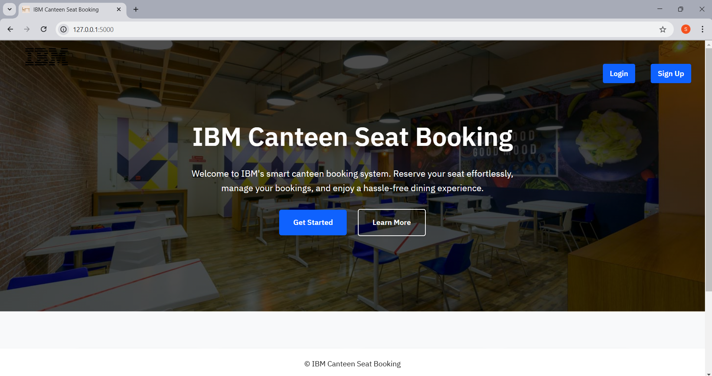

# IBM Canteen Application



## Create virtual environment 
```
python -m venv venv
venv\Scripts\activate
```

## Install the requirements
```
pip freeze requirements.txt
pip install -r requirements.txt
```
